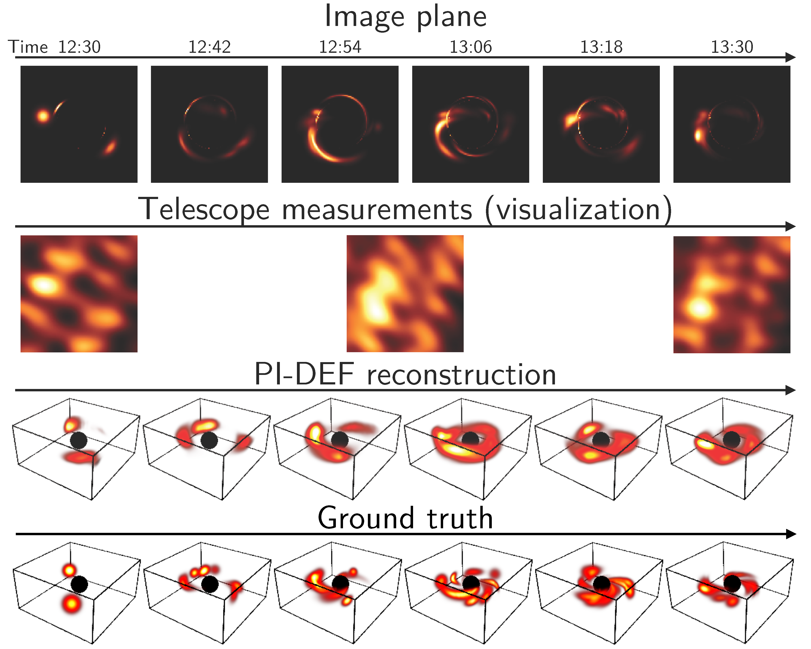

# Physics-informed Dynamic Emission Fields (PI-DEF)
Official code for the CVPR 2026 [paper](https://arxiv.org/abs/2304.11751) "Dynamic Black-hole Emission Tomography with Physics-informed Neural Fields."
```
@inproceedings{feng2026pidef,
  title={Dynamic Black-hole Emission Tomography with Physics-informed Neural Fields},
  author={Feng, Berthy T and Chael, Andrew A and Bromley, David and Levis, Aviad and Freeman, William T and Bouman, Katherine L},
  booktitle={Proc. IEEE Conference on Computer Vision and Pattern Recognition (CVPR)},
  year={2026},
  organization={IEEE/CVF}
}
```

PI-DEF (Physics-informed Dynamic Emission Fields) infers the 4D emissivity field and 3D velocity field near a black hole given EHT measurements. The method involves two neural fields to represent the emissivity and velocity fields, which are jointly optimized according to a data-fit loss, dynamics loss, and light velocity regularization. So far, we have performed experiments on simulated EHT measurements of simulated emissivity fields. 




## Environment
Run the following commands to set up the Conda environment. The code was most recently tested with JAX v0.4.3 for CUDA 12.
```
conda update -n base -c defaults conda
conda create -y -n pidef python=3.9
conda activate pidef
```

Install the [kgeo](https://github.com/achael/kgeo) submodule in [bhnerf](https://github.com/aviadlevis/bhnerf):
```
git clone --recurse-submodules https://github.com/aviadlevis/bhnerf.git
pip install bhnerf/kgeo
rm -rf bhnerf
```

Install [xarray](https://docs.xarray.dev/en/stable/) and its dependencies:
```
conda install -y -c conda-forge xarray dask netCDF4 bottleneck
```

Install a forked version of [ehtim](https://github.com/achael/eht-imaging) v1.2.10 that resolves a bug and some warnings:
```
git clone https://github.com/berthyf96/eht-imaging
pip install eht-imaging/
rm -rf eht-imaging
```

Install remaining requirements:
```
conda install -y -c conda-forge ffmpeg
pip install ml-collections jupyterlab seaborn ipywidgets
pip install "jax[cuda12]"
pip install flax optax orbax-checkpoint diffrax
```


## Running an experiment
The script `run.py` simulates data and fits PI-DEF to the simulated measurements.
The following commands are provided to run experiments from the paper:
* `scripts/eht.sh`: fitting to noiseless EHT complex visibilities. You can try different EHT arrays by changing `config.sim.array` to one of the following: `eht_arrays/EHT2017.txt`, `eht_arrays/EHT2025.txt`, `eht_arrays.ngEHT.txt`.
* `scripts/image.sh`: fitting to noiseless full-image measurements (the highest-possible measurement resolution)
* `scripts/eht_realistic_gaussian_noise.sh`: fitting to EHT complex visibilities with realistic Gaussian noise
* `scripts/eht_closure_phases_and_amps.sh`: fitting to EHT closure phases and visbility amplitudes

The scripts will save experiment results to a folder of the form `./runs/{simulation_description}/{measurement_setting}/{hyperparameter_setting}`.

## Demo
The `demo.ipynb` notebook walks through how to simulate data, optimize PI-DEF, and evaluate PI-DEF. It basically guides you through all the steps in the script `scripts/eht.sh`, visualizing data along the way and visualizing the results after optimization. Since optimization can take a long time, you can download and use the checkpoints [here](https://caltech.box.com/s/nvjyke2tmoyhlj2ymc4llp6bt6u4qqul).